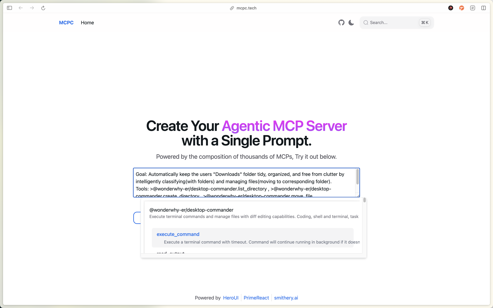

# [MCPC](https://mcpc.tech/) &middot; [](https://jsr.io/@mcpc/core)

MCPC: One prompt to instantly build scalable agentic MCP servers from thousands
of dependent MCPs.

> Read more at
> [Introducing MCPC: One Prompt for Your Agentic MCP Server, Powered by Thousands](https://x.com/yaoandyan/article/1921532787905237398)

## ⭐ Key Features

🤖 **Intelligent Execution Modes**

- **Agentic Mode:** Fully autonomous agents with self-orchestration
- **Workflow Mode:** Structured step-by-step execution with state management
- **Dynamic Workflows:** Runtime step generation based on context

🔧 **Advanced Tool Management**

- **Tool Overrides:** Customize descriptions and hide sensitive operations
- **Internal Tools:** Internal tools for security and audit logging
- **Wildcard Selection:** Use `__ALL__` to include all tools from an MCP server
- **Smart Namespacing:** Automatic conflict resolution and organization

🌐 **Multi-MCP Integration**

- **Seamless Composition:** Combine multiple MCP servers into unified workflows
- **Intelligent Orchestration:** Automatic tool coordination across different
  servers
- **Dependency Management:** Declarative configuration for external MCP servers

# Getting Started

## 1. Get Started Instantly via Our Website

For the fastest and most straightforward path, simply visit mcpc.tech. Our
user-friendly online platform provides an intuitive interface where you can
declare your agentic workflows and provision your MCP servers with ease – all
just with a few clicks. It's the ideal way to grasp the power of one-prompt
automation firsthand.



After defining your agentic workflow, simply click the **"Generate" button** to
effortlessly create your custom Agentic MCP Server. You can then seamlessly copy
and paste the generated configuration into your preferred MCP client (e.g.,
Claude Desktop) for rapid integration.

What's more, this powerful workflow configuration can be easily **shared with
your colleagues or anyone interested**. This not only fosters team collaboration
and knowledge sharing but also allows more people to experience the automation
solutions you've built.

## 2. Programmatic Integration

For developers seeking deep integration and customization, MCPC provides a
comprehensive SDK with powerful composition capabilities:

```bash
# Use with deno
deno install jsr:@mcpc/core
# Use with pnpm
pnpm install jsr:@mcpc/core
# Use with yarn
yarn add jsr:@mcpc/core
# Use with npm
npx jsr add @mcpc/core
```

### Basic Composition Example

```typescript
import { StdioServerTransport } from "@modelcontextprotocol/sdk";
import { mcpc } from "@mcpc/core";

// 1. Define dependencies
const dependencies = {
  mcpServers: {
    "@wonderwhy-er/desktop-commander": {
      command: "npx",
      args: ["-y", "@wonderwhy-er/desktop-commander@latest"],
    },
  },
};

// 2. Write agent description
const agentDescription =
  `I am an intelligent file organizer with advanced capabilities.

Available tools:
<tool name="@wonderwhy-er/desktop-commander.list_directory"/>
<tool name="@wonderwhy-er/desktop-commander.create_directory"/>
<tool name="@wonderwhy-er/desktop-commander.move_file"/>

I can automatically organize files by type, date, and content with smart conflict resolution.`;

// 3. Create server using mcpc API
export const server = await mcpc(
  [
    {
      name: "smart-file-manager",
      version: "1.0.0",
    },
    { capabilities: { tools: { listChanged: true } } },
  ],
  [
    {
      name: "file-organizer",
      description: agentDescription,
      deps: dependencies,
    },
  ],
);

const transport = new StdioServerTransport();
await server.connect(transport);
```

## 🔧 Core Features

### Execution Modes

**Agentic Mode** - Complete autonomy and self-orchestration

```typescript
{
  name: "autonomous-analyst",
  options: { mode: "agentic" },
  description: `I autonomously analyze data and make decisions...`
}
```

**Workflow Mode** - Structured step-by-step execution

```typescript
{
  name: "structured-processor",
  options: {
    mode: "agentic_workflow",
    steps: [
      { description: "Analyze input", actions: ["reasoning"] },
      { description: "Process data", actions: ["tool1", "tool2"] },
      { description: "Generate output", actions: ["tool3"] }
    ]
  }
}
```

**Dynamic Workflows** - Runtime step generation

```typescript
{
  options: { mode: "agentic_workflow" }, // No predefined steps
  description: `I generate workflow steps dynamically based on the task...`
}
```

### Tool Management

**Tool Selection**

```typescript
description: `
Available tools:
<tool name="server.specific_tool"/>
<tool name="server.__ALL__"/>  // Include all tools
<tool name="tool1" description="Enhanced description"/>
<tool name="sensitive_tool" hide/>  // Hide from public interface
`;
```

**Internal Tools and Security**

```typescript
// Register internal tools
server.tool("audit-logger", "Internal logging", schema, callback, { internal: true });

// Use internal tools in public interfaces
server.tool("secure-operation", "Safe operation", schema, async (args) => {
  await server.callTool("audit-logger", {...});
  // Secure operation logic
});
```

### Multi-MCP Integration

**Seamless Composition**

```typescript
deps: {
  mcpServers: {
    "@microsoft/playwright-mcp": {
      command: "npx",
      args: ["@playwright/mcp@latest"]
    },
    "code-runner": {
      command: "deno",
      args: ["run", "--allow-all", "jsr:@mcpc/code-runner-mcp/bin"]
    },
    "@wonderwhy-er/desktop-commander": {
      command: "npx",
      args: ["-y", "@wonderwhy-er/desktop-commander@latest"]
    }
  }
}
```

### Core API Overview

MCPC provides a simple and powerful API for creating intelligent MCP servers.
The core workflow follows three steps: define dependencies, write agent
descriptions, and create servers using the mcpc API.

## 📚 Comprehensive Examples

Explore our complete example collection demonstrating all MCPC features:

### Core Examples

- **[Basic File Manager](packages/core/examples/comprehensive-features/01-basic-file-manager.ts)** -
  Simple composition and tool selection
- **[Agentic Data Analyst](packages/core/examples/comprehensive-features/02-agentic-data-analyst.ts)** -
  Autonomous mode with complete flexibility
- **[Workflow Image Generator](packages/core/examples/comprehensive-features/03-workflow-image-generator.ts)** -
  Structured workflows with predefined steps
- **[Dynamic Document Processor](packages/core/examples/comprehensive-features/04-dynamic-workflow-processor.ts)** -
  Runtime workflow generation

### Advanced Examples

- **[Tool Override Manager](packages/core/examples/comprehensive-features/05-tool-override-manager.ts)** -
  Advanced tool management and security
- **[Multi-MCP Web Analyzer](packages/core/examples/comprehensive-features/06-multi-mcp-web-analyzer.ts)** -
  Complex multi-server integration
- **[Thinking Middleware Agent](packages/core/examples/comprehensive-features/07-thinking-middleware-agent.ts)** -
  Transparent AI reasoning

Each example is complete, runnable, and demonstrates specific MCPC capabilities
with detailed documentation.

## 🚀 Use Cases

### DevOps & Automation

- **CI/CD Pipeline Management:** Orchestrate build, test, and deployment
  workflows
- **Infrastructure Monitoring:** Real-time system health and performance
  tracking
- **Log Analysis:** Intelligent parsing and alerting for system events
- **Deployment Automation:** Multi-stage deployment with validation and rollback

### Data Processing & Analytics

- **ETL Pipelines:** Extract, transform, and load data from multiple sources
- **Report Generation:** Automated analysis and visualization creation
- **Data Quality Monitoring:** Continuous validation and quality assurance
- **Machine Learning Workflows:** Model training, evaluation, and deployment

### Content Creation & Management

- **Document Processing:** Intelligent parsing, transformation, and organization
- **Image Generation:** Dynamic visual content creation with HTML/CSS rendering
- **Website Analysis:** SEO, performance, and accessibility auditing
- **Content Optimization:** Automated improvements and recommendations

### Security & Compliance

- **Audit Logging:** Comprehensive tracking for regulatory compliance
- **Security Scanning:** Automated vulnerability detection and reporting
- **Access Control:** Role-based permissions and secure operations
- **Incident Response:** Automated threat detection and mitigation

## 🔗 Integration

### Connect to Claude Desktop

Create your MCPC server file (e.g., `my-server.ts`):

```typescript
import { mcpc } from "@mcpc/core";
import { StdioServerTransport } from "@modelcontextprotocol/sdk/server/stdio.js";

const server = await mcpc(
  [{ name: "my-assistant", version: "1.0.0" }],
  [
    {
      name: "intelligent-helper",
      description: `I can help with various tasks using multiple tools.`,
      deps: {
        mcpServers: {
          "@wonderwhy-er/desktop-commander": {
            command: "npx",
            args: ["-y", "@wonderwhy-er/desktop-commander@latest"],
          },
        },
      },
    },
  ],
);

const transport = new StdioServerTransport();
await server.connect(transport);
```

Add to Claude Desktop configuration:

```json
{
  "mcpServers": {
    "my-assistant": {
      "command": "deno",
      "args": ["run", "--allow-all", "path/to/my-server.ts"]
    }
  }
}
```

## 📖 Documentation

- **[Comprehensive Examples](packages/core/examples/comprehensive-features/)** -
  Complete feature demonstrations
- **[Core API Reference](packages/core/src/)** - Detailed API documentation
- **[Integration Guides](packages/core/examples/)** - Platform-specific
  integration examples

## 🛠️ Development

```bash
# Clone the repository
git clone https://github.com/mcpc-tech/mcpc.git
cd mcpc

# Install dependencies
deno install

# Run examples
deno run --allow-all packages/core/examples/comprehensive-features/01-basic-file-manager.ts
```

## 🤝 Contributing

MCPC is an open-source project welcoming contributions. Whether you're building
new MCP integrations, improving existing features, or creating examples, we'd
love your help!

- **Report Issues:** [GitHub Issues](https://github.com/mcpc-tech/mcpc/issues)
- **Feature Requests:**
  [Discussions](https://github.com/mcpc-tech/mcpc/discussions)
- **Pull Requests:** [Contributing Guide](CONTRIBUTING.md)

## 📄 License

MIT License - see [LICENSE](LICENSE) for details.
