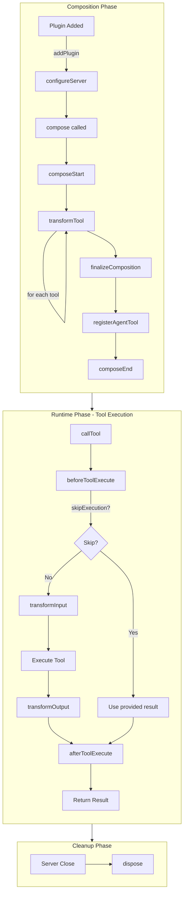
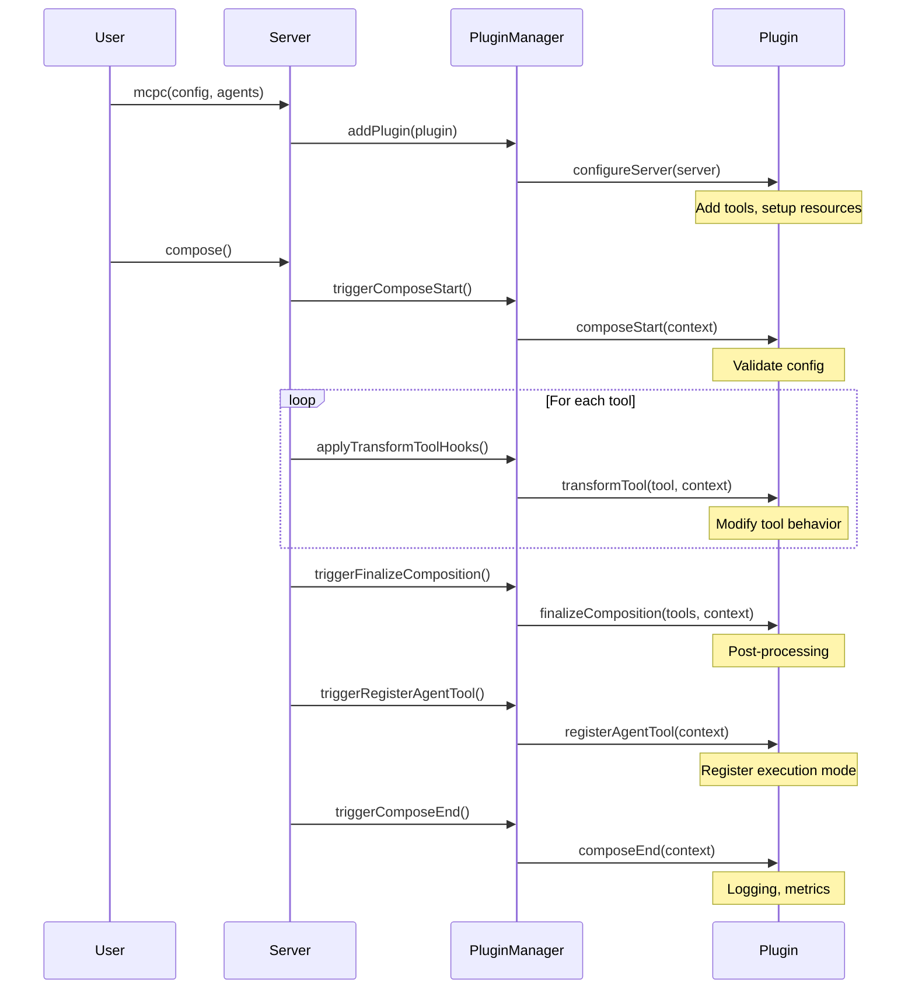
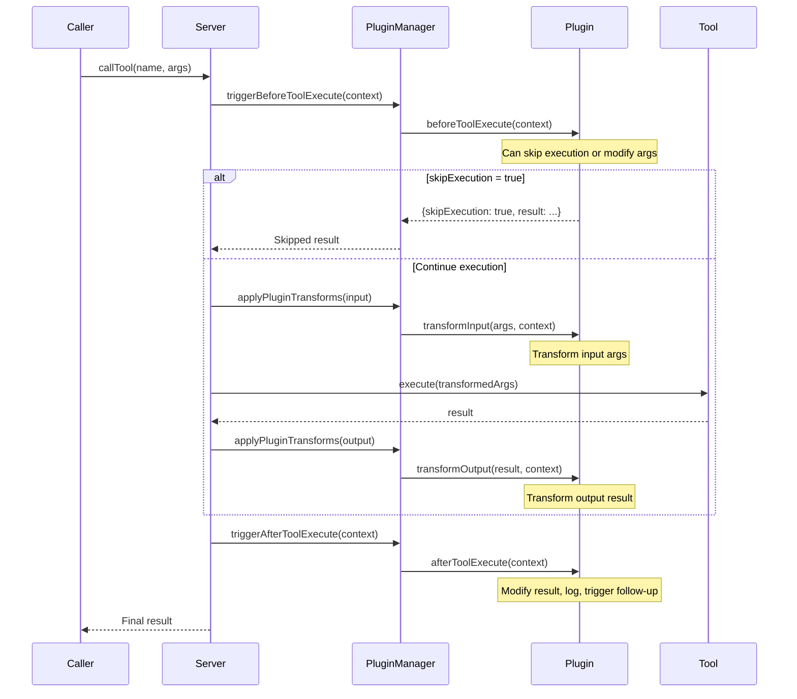
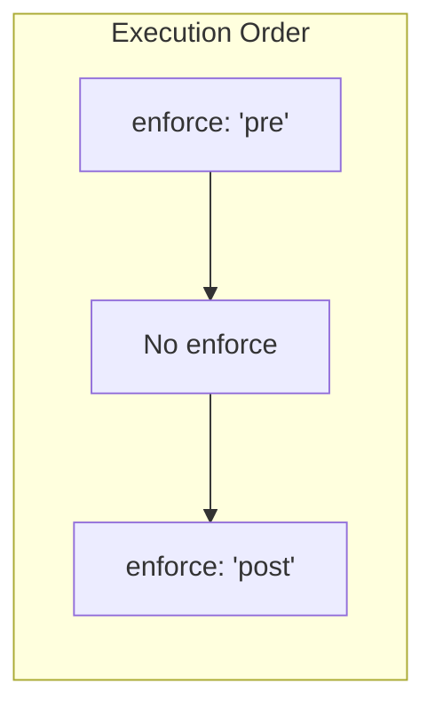
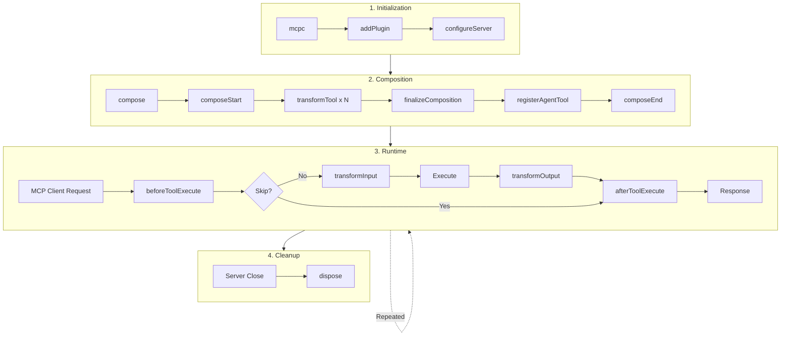

# Plugin Lifecycle Guide

This document describes the complete lifecycle of MCPC plugins, from server
initialization to tool execution.

## Overview

MCPC plugins have two main lifecycle phases:

1. **Composition Phase** - Server setup and tool registration
2. **Runtime Phase** - Tool execution with input/output transformation

## Lifecycle Diagram



## Composition Phase Hooks

These hooks are called during server setup and tool composition.



### Hook Details

| Hook                  | When Called                       | Purpose                                         |
| --------------------- | --------------------------------- | ----------------------------------------------- |
| `configureServer`     | Plugin added to server            | Initial setup: add tools, initialize resources  |
| `composeStart`        | Before composition begins         | Validate configuration, prepare for composition |
| `transformTool`       | For each tool during composition  | Modify tool behavior, wrap execute function     |
| `finalizeComposition` | After all tools composed          | Post-processing, validation                     |
| `registerAgentTool`   | After finalize, before composeEnd | Register custom execution modes                 |
| `composeEnd`          | Composition complete              | Logging, metrics, final cleanup                 |

## Runtime Phase Hooks

These hooks are called during tool execution.



### Hook Details

| Hook                | When Called                     | Purpose                                                        |
| ------------------- | ------------------------------- | -------------------------------------------------------------- |
| `beforeToolExecute` | Before tool execution           | Intercept calls, modify args, skip execution (dynamic handoff) |
| `transformInput`    | Before execute (if not skipped) | Transform input arguments                                      |
| `transformOutput`   | After execute                   | Transform output result                                        |
| `afterToolExecute`  | After execution or skip         | Modify final result, logging, follow-up actions                |

### Hook Execution Order

```
callTool(name, args)
  │
  ├─► beforeToolExecute(context)
  │     ├─► Can return {skipExecution: true, result: ...}
  │     └─► Can return {modifiedArgs: ...}
  │
  ├─► [if not skipped] transformInput(args)
  │
  ├─► [if not skipped] tool.execute(args)
  │
  ├─► [if not skipped] transformOutput(result)
  │
  └─► afterToolExecute(context)
        └─► Can return {modifiedResult: ...}
```

## Plugin Execution Order

Plugins are sorted by `enforce` option:



Within each group, plugins execute in registration order.

## Context Objects

### BeforeToolExecuteContext

```typescript
interface BeforeToolExecuteContext {
  toolName: string; // Tool being executed
  args: unknown; // Input arguments
  server: ComposableMCPServer;
  toolDefinition?: ComposedTool;
  isInternalCall: boolean; // true if called within agent
  agentName?: string; // Parent agent name (if internal)
  executionChain?: string[]; // Nested agent calls
}
```

### AfterToolExecuteContext

```typescript
interface AfterToolExecuteContext {
  toolName: string;
  args: unknown; // Original arguments
  result: unknown; // Execution result
  server: ComposableMCPServer;
  wasSkipped: boolean; // true if beforeToolExecute skipped
  executionTimeMs: number; // Execution duration
  isError: boolean; // Result indicates error
  metadata?: Record<string, unknown>; // From beforeToolExecute
  isInternalCall: boolean;
  agentName?: string;
}
```

### RuntimeTransformContext

```typescript
interface RuntimeTransformContext {
  toolName: string;
  server: ComposableMCPServer;
  originalArgs?: unknown; // Available in transformOutput
  direction: "input" | "output";
}
```

## Use Cases

### 1. Dynamic Tool Handoff to AI Agent

Use `beforeToolExecute` to intercept tool calls and delegate to an AI agent:

```typescript
const aiHandoffPlugin = {
  name: "ai-handoff",
  beforeToolExecute: async (context) => {
    if (shouldDelegateToAI(context.toolName)) {
      const aiResult = await askAI(context.toolName, context.args);
      return {
        skipExecution: true,
        result: { content: [{ type: "text", text: aiResult }] },
        metadata: { handedOff: true },
      };
    }
  },
  afterToolExecute: (context) => {
    if (context.metadata?.handedOff) {
      console.log(`AI handled ${context.toolName}`);
    }
  },
};
```

### 2. Argument Validation & Transformation

```typescript
const validationPlugin = {
  name: "validation",
  beforeToolExecute: (context) => {
    const validated = validateArgs(context.args);
    if (validated.errors) {
      return {
        skipExecution: true,
        result: {
          content: [{ type: "text", text: validated.errors }],
          isError: true,
        },
      };
    }
    return { modifiedArgs: validated.sanitized };
  },
};
```

### 3. Execution Logging & Metrics

```typescript
const metricsPlugin = {
  name: "metrics",
  beforeToolExecute: (context) => {
    return { metadata: { startTime: Date.now() } };
  },
  afterToolExecute: (context) => {
    const duration = Date.now() - (context.metadata?.startTime || 0);
    metrics.record(context.toolName, {
      duration,
      success: !context.isError,
      wasSkipped: context.wasSkipped,
    });
  },
};
```

### 4. Agent Context Tracking

```typescript
const contextPlugin = {
  name: "context-tracker",
  beforeToolExecute: (context) => {
    if (context.isInternalCall) {
      console.log(`Agent "${context.agentName}" calling ${context.toolName}`);
      console.log(`Execution chain: ${context.executionChain?.join(" → ")}`);
    }
  },
};
```

## Complete Lifecycle Example



## Best Practices

1. **Use `beforeToolExecute` for**:
   - Dynamic delegation/handoff
   - Early validation
   - Skipping expensive operations
   - Passing metadata to `afterToolExecute`

2. **Use `transformInput/transformOutput` for**:
   - Data format transformation
   - Sanitization
   - Schema normalization

3. **Use `afterToolExecute` for**:
   - Logging and metrics
   - Result modification
   - Triggering side effects
   - Cleanup after tool execution

4. **Prefer `beforeToolExecute` over `transformInput`** when you might skip
   execution entirely.

5. **Pass state via `metadata`** from `beforeToolExecute` to `afterToolExecute`
   instead of using plugin instance state.

## Related Documentation

- [Plugin System Guide](./plugins.md) - Creating and configuring plugins
- [Execution Modes](./execution-modes.md) - Different agent execution modes
