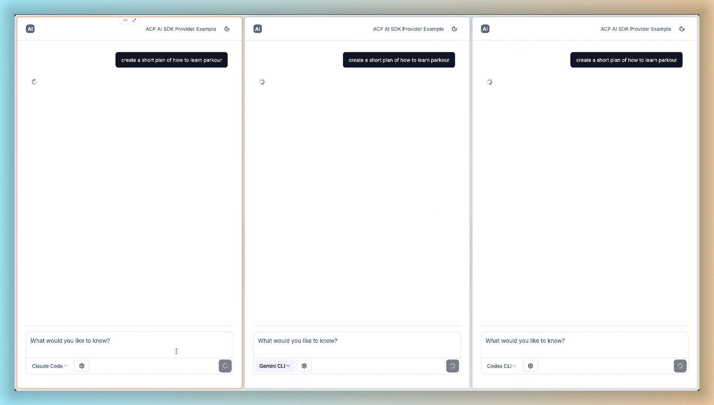

# @mcpc/acp-ai-provider

[](https://www.npmjs.com/package/@mcpc-tech/acp-ai-provider)
[](https://jsr.io/@mcpc/acp-ai-provider)

Use [ACP (Agent Client Protocol)](https://agentclientprotocol.com/) agents with
the [AI SDK](https://ai-sdk.dev/).



This package bridges ACP agents to the AI SDK. It spawns ACP agents (Claude
Code, Gemini, Codex CLI, and more) as child processes and exposes them through
the AI SDK's `LanguageModelV2` protocol.

[Try a full stack web ACP example here](https://github.com/mcpc-tech/ai-elements-remix-template)

## Installation

```bash
# npm
npm i @mcpc-tech/acp-ai-provider

# deno
deno add jsr:@mcpc/acp-ai-provider
```

## Usage

[See all examples](https://github.com/mcpc-tech/mcpc/tree/main/packages/acp-ai-provider/examples)

### Basic Example

```typescript
import { createACPProvider } from "@mcpc/acp-ai-provider";
import { generateText } from "ai";
import process from "node:process";

// Create provider for an ACP agent
const provider = createACPProvider({
  command: "gemini",
  args: ["--experimental-acp"],
  session: {
    cwd: process.cwd(),
    mcpServers: [],
  },
});

// Use with AI SDK
const result = await generateText({
  model: provider.languageModel(),
  prompt: "Hello, what can you help me with?",
});

console.log(result.text);
```

### Streaming Example

```typescript
import { createACPProvider } from "@mcpc/acp-ai-provider";
import { streamText } from "ai";
import process from "node:process";

const provider = createACPProvider({
  command: "claude-code-acp",
  args: [],
  session: {
    cwd: process.cwd(),
    mcpServers: [],
  },
});

const { textStream } = streamText({
  model: provider.languageModel(),
  prompt: "Write a simple Hello World program",
});

for await (const chunk of textStream) {
  process.stdout.write(chunk);
}
```

### With Tools (MCP Servers)

Tools are defined through MCP (Model Context Protocol) servers, not AI SDK's
`tools` parameter:

```typescript
const provider = createACPProvider({
  command: "gemini",
  args: ["--experimental-acp"],
  session: {
    cwd: process.cwd(),
    mcpServers: [
      {
        type: "stdio",
        name: "filesystem",
        command: "npx",
        args: ["-y", "@modelcontextprotocol/server-filesystem", "/tmp"],
      },
    ],
  },
});

const result = await generateText({
  model: provider.languageModel(),
  prompt: "List files in /tmp",
});
```

### Dynamic Host-Side Tools (Experimental)

You can also define AI SDK-style tools that execute on the host side:

```typescript
const provider = createACPProvider({
  command: "claude-code-acp",
  session: { cwd: process.cwd(), mcpServers: [] },
  tools: {
    greet: {
      description: "Greet a person by name",
      parameters: {
        type: "object",
        properties: { name: { type: "string" } },
        required: ["name"],
      },
      execute: async (args) => `Hello, ${(args as any).name}!`,
    },
  },
});

const result = await streamText({
  model: provider.languageModel(),
  prompt: "Please greet Alice",
});
```

#### How It Works (TCP Socket Callback)

Since ACP agents spawn their own MCP server subprocesses, we use a TCP socket
for the runtime to call back to the host for tool execution:

```
┌─────────────────────────────────────────────────────────┐
│  Host Process                                           │
│    - Starts TCP server (random port)                    │
│    - Passes TCP port via env vars to ACP                │
│                         ▲    │                          │
│                         │    │ TCP (getTools → definitions)
│                         │    │ TCP (callHandler → execute)
│                         │    │                          │
└─────────────────────────┼────┼──────────────────────────┘
                          │    │
┌─────────────────────────┼────┼──────────────────────────┐
│  ACP Agent spawns tool-proxy-runtime                    │
│    - Reads port from ACP_TOOL_PROXY_PORT env            │
│    - Connects and requests tools via `getTools`         │
│    - On MCP tools/call → TCP callHandler → result       │
└─────────────────────────────────────────────────────────┘
```

### Session Persistence

Keep sessions alive for multi-turn conversations:

```typescript
const provider = createACPProvider({
  command: "gemini",
  args: ["--experimental-acp"],
  session: { cwd: process.cwd(), mcpServers: [] },
  persistSession: true, // Keep session alive
});

const model = provider.languageModel();
await generateText({ model, prompt: "Hi, my name is Alice" });
await generateText({ model, prompt: "What's my name?" }); // Agent remembers

provider.cleanup(); // Clean up when done
```

Resume a previous session:

```typescript
const provider = createACPProvider({
  command: "gemini",
  args: ["--experimental-acp"],
  session: { cwd: process.cwd(), mcpServers: [] },
  existingSessionId: "previous-session-id",
  persistSession: true,
});
```

### Selecting Models and Modes

Some ACP agents support multiple models or modes. Use `initSession()` to
discover and select them:

```typescript
const provider = createACPProvider({
  command: "claude",
  args: ["--mcp"],
  session: { cwd: process.cwd(), mcpServers: [] },
  persistSession: true,
});

// Initialize and get available options
const session = await provider.initSession();

// Check available modes (e.g., "ask", "code", "architect")
console.log(session.modes?.availableModes);

// Check available models
console.log(session.models?.availableModels);

// Select a mode before prompting
await provider.setMode("code");

// Now use the model
const result = await generateText({
  model: provider.languageModel(),
  prompt: "...",
});
```

## FAQ

### How to stream tool calls

Tools are passed to the AI SDK as
[provider-defined tools](https://ai-sdk.dev/docs/reference/ai-sdk-core/tool#tool.tool.type)
because they are called and executed by the ACP agent (for example, Codex).

So, to stream tool calls, pass the provider tools to the AI SDK:

```ts
const result = await generateText({
  model: provider.languageModel(),
  prompt: "List files in /tmp",
  tools: provider.tools(),
});
```

The actual tool name and arguments live inside
`acp.acp_provider_agent_dynamic_tool`'s input and follow this structure:

```ts
export const providerAgentDynamicToolSchema = z.object({
  toolCallId: z.string().describe("The unique ID of the tool call."),
  toolName: z.string().describe("The name of the tool being called."),
  args: z.record(z.any()).describe("The input arguments for the tool call."),
});
```

## Limitations

- **No token counting** — ACP doesn't provide token usage information (it always
  returns 0).
- **Dynamic tools are experimental** — The `tools` parameter uses TCP callback
  which adds some complexity.

## Related

- [AI SDK](https://ai-sdk.dev/)
- [ACP Specification](https://agentclientprotocol.com/overview/introduction)

## License

MIT
