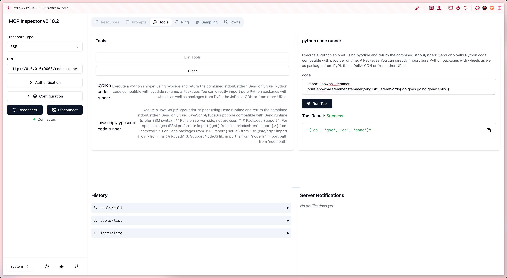

# Code Runner MCP

> @mcpc/code-runner-mcp


> Inspired by https://ai.pydantic.dev/mcp/run-python/, reimplemented to simplify pkg install and add JavaScript support.

Run Javascript/Python code in a secure sandbox, with support for importing **any package**! 🚀



**Core Capabilities:**

- **Secure Sandbox:** 🛡️ Code runs in an isolated environment with strict restrictions on file system, network, and environment variable access to prevent malicious code from affecting the host environment.
- **Multi-language Support:** 🌈 Execute JavaScript/TypeScript and Python code snippets with ease.
- **Dynamic Package Imports:** 📦 Import and use external libraries on-the-fly (support level depends on the chosen runtime).

# How to Use

1. Cloud ☁️

```sh
docker run -p 9000:9000 TODO:
```

Configuration:

```json
{
  "mcpServers": {
    "code-runner": {
      "url": "http://localhost:9000/code-runner/sse",
      "transportType": "sse"
    }
  }
}
```

2. Local 🖥️

```sh
# Clone and cd to this directory
git clone https://github.com/mcpc-tech/mcpc.git && cd mcpc/packages/code-runner-mcp

# http
deno run --allow-all src/server.ts
# stdio
deno run --allow-all src/stdio.server.ts
```

Configuration:

1. HTTP Server:

```json
{
  "mcpServers": {
    "code-runner": {
      "url": "http://localhost:9000/code-runner/sse",
      "transportType": "sse"
    }
  }
}
```

2. STDIO Server:

```json
{
  "mcpServers": {
    "code-runner": {
      "command": "deno",
      "args": [
        "run",
        "--allow-all",
        "/path_to_mcpc/packages/code-runner-mcp/src/stdio.server.ts"
      ],
      "transportType": "stdio"
    }
  }
}
```

# JavaScript/TypeScript -> `deno run` 🦕

1.  **Runtime Environment:** Leverages [Deno](https://deno.land/) runtime to execute JavaScript and TypeScript with lightning speed! ⚡
2.  **Native TypeScript Support:** Run TypeScript (`.ts`) files directly without any compilation steps - how cool is that! 😎
3.  **Dynamic Imports & Dependencies:**
    - Embraces ES modules standard, import dependencies straight from URLs! 🔗
    - Import npm packages using the `npm:` specifier - Deno downloads and caches them on first use, no `npm install` needed! 🎯
4.  **Strict Permission Policy:** Deno takes security seriously! 🔒 File, network, and environment access require explicit permission flags (like `--allow-read`, `--allow-net`, `--allow-env`). Your code runs in a fortified sandbox, keeping those security risks at bay!

> Need extra permissions? Use the DENO_PERMISSION_ARGS environment variable to declare additional flags like `--allow-env --allow-net`. Check out [Security and permissions](https://docs.deno.com/runtime/fundamentals/security/) for more details! 🛡️

# Python -> `pyodide` 🐍

1.  **Runtime Environment:** Uses [Pyodide](https://pyodide.org/) to compile CPython into WebAssembly (WASM). Your code runs in a WASM virtual machine, completely isolated from the host system! 🏰
2.  **Browser/WASM Sandbox:** Running in WebAssembly's sandbox environment provides natural isolation - it's like your code's private fortress! 🔒
3.  **Package Management (`micropip`):**
    - Pyodide comes with `micropip` built-in! 📦
    - Install packages from PyPI at runtime using `micropip.install()`. Get your favorite pure Python packages and specially-built scientific computing packages (like NumPy, Pandas) instantly! 🚀
    - **Note:** Not all PyPI packages work out of the box, especially those with C extensions that haven't been ported to the Emscripten/Pyodide ecosystem yet. 🔧
4.  **Client-side/Isolated Execution:** Run Python code in browsers or standalone WASM runtimes (like Wasmer, Wasmtime). No need to spin up separate Python processes for each request on the server! 💪
5.  **Python Version:** Pyodide ships with a specific CPython version (e.g., Pyodide 0.25.x rocks Python 3.11). 🎯

# Key Benefits & Use Cases 🌟

- **Security:** Rock-solid protection when executing code from users or other untrusted sources! 🛡️
- **Flexibility:** Dynamically execute custom logic, process data, and run computations in AI Agents, automation workflows, or online code editors! 🎯
- **Convenience:** Setting up environments for running simple scripts and loading libraries has never been easier! 🚀

# Important Notes ⚠️

- **Performance:** Sandbox environments (especially WebAssembly) might have some performance overhead compared to native execution. 🏃‍♂️
- **Package Compatibility:**
  - Deno's compatibility with Node.js built-ins and some npm packages isn't perfect yet. 🔄
  - Pyodide's `micropip` can't install all PyPI packages - C extensions are the main limitation. 📦
- **Resource Limits:** Sandbox environments typically have restrictions on memory usage, execution time, and other resources. ⏱️
- **Permission Management (Deno):** Carefully configure Deno permissions to balance functionality needs with security principles! 🔒
