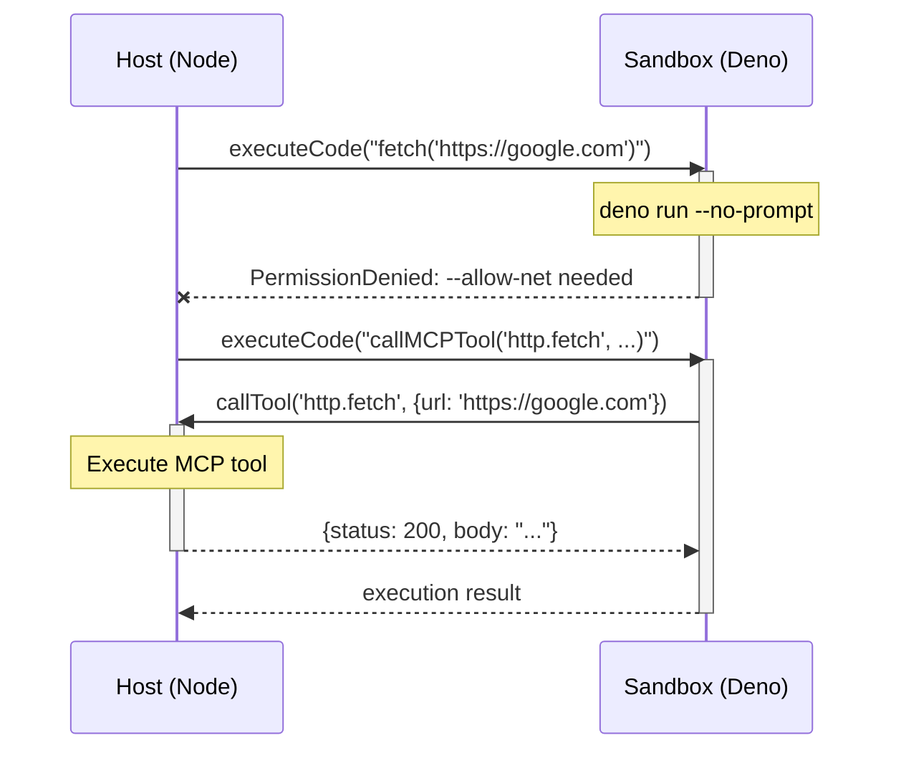

# @mcpc/plugin-code-execution

[](https://jsr.io/@mcpc/plugin-code-execution)
[](https://www.npmjs.com/package/@mcpc-tech/plugin-code-execution)

Secure JavaScript code execution sandbox using Deno for MCPC agents. This
package provides a safe environment to execute user-provided JavaScript code
with MCP tool access via JSON-RPC IPC.

## Features

- 🔒 **Secure Sandboxing**: Uses Deno's permission system for isolated code
  execution
- 🔌 **JSON-RPC IPC**: Tool calls are transmitted via JSON-RPC between sandbox
  and host
- 🚀 **Easy Integration**: Plugin-based integration with MCPC
- 📦 **Zero Config**: Automatically locates Deno binary from npm package
- 🛡️ **Resource Limits**: Configurable timeouts and memory limits

## Installation

```bash
# npm
npm install @mcpc-tech/plugin-code-execution
pnpm add @mcpc-tech/plugin-code-execution

# jsr
npx jsr add @mcpc/plugin-code-execution
pnpm add jsr:@mcpc/plugin-code-execution
```

## Usage

### Basic Usage

```typescript
import { mcpc } from "@mcpc/core";
import { createCodeExecutionPlugin } from "@mcpc/plugin-code-execution/plugin";

const server = await mcpc(
  [{ name: "my-agent", version: "1.0.0" }, {
    capabilities: { tools: {} },
  }],
  [{
    name: "my-agent",
    description: `
      An agent that can execute JavaScript code securely.
      <tool name="filesystem.read_file"/>
      <tool name="filesystem.write_file"/>
    `,
    deps: {
      mcpServers: {
        "filesystem": {
          command: "npx",
          args: ["-y", "@wonderwhy-er/desktop-commander@latest"],
          transportType: "stdio",
        },
      },
    },
    plugins: [
      createCodeExecutionPlugin({
        sandbox: {
          timeout: 30000, // 30 seconds
          memoryLimit: 512, // 512 MB
          permissions: [], // No extra permissions
        },
      }),
    ],
    options: {
      mode: "code_execution",
    },
  }],
);
```

### How It Works

The plugin uses bidirectional JSON-RPC communication:

1. Host spawns Deno sandbox subprocess
2. Host sends `executeCode` request with user's JavaScript code
3. Sandbox runs the code
4. When code calls `callMCPTool(toolName, params)`:
   - Sandbox sends `callTool` request to host
   - Host executes the actual MCP tool
   - Host sends response back to sandbox
   - Sandbox receives result and continues code execution
5. Sandbox returns final execution result to host

### Security Model

The Deno sandbox runs with minimal permissions by default. You control access by
passing Deno permission flags directly:

```typescript
// No permissions - can only call MCP tools
createCodeExecutionPlugin();

// Allow network access to specific domains
createCodeExecutionPlugin({
  sandbox: {
    permissions: ["--allow-net=github.com,api.example.com"],
  },
});

// Allow reading specific directories
createCodeExecutionPlugin({
  sandbox: {
    permissions: ["--allow-read=/tmp,/var/log"],
  },
});
```

### Configuration Options

```typescript
interface SandboxConfig {
  timeout?: number; // Execution timeout in ms (default: 30000)
  memoryLimit?: number; // Memory limit in MB (default: unlimited)
  permissions?: string[]; // Deno flags, e.g., ["--allow-net", "--allow-read=/tmp"]
}
```

Example with custom permissions:

```typescript
createCodeExecutionPlugin({
  sandbox: {
    timeout: 60000,
    permissions: [
      "--allow-net=api.example.com",
      "--allow-read=/tmp",
      "--allow-env=HOME,USER",
    ],
  },
});
```

## Architecture



**Permission Model**

```typescript
// Sandbox runs WITHOUT permissions by default
// ❌ These operations will fail:
const code = `
  await Deno.readTextFile('/file.txt');        // PermissionDenied: --allow-read needed
  await fetch('https://api.com');               // PermissionDenied: --allow-net needed
  Deno.env.get('SECRET');                       // PermissionDenied: --allow-env needed
`;

// ✅ All operations must go through MCP tools:
const code = `
  await callMCPTool('desktop-commander.read_file', { path: '/file.txt' });
  await callMCPTool('http-client.fetch', { url: 'https://api.com' });
`;

// Or grant specific permissions if needed:
createCodeExecutionPlugin({
  sandbox: {
    permissions: ["--allow-net=api.example.com", "--allow-read=/tmp"],
  },
});
```

## Examples

See `examples/` directory for complete examples:

- `basic-usage.ts` - Simple code execution with plugin integration

## Development

```bash
# Run tests
deno test --allow-all tests/

# Run example
deno run --allow-all examples/basic-usage.ts
```

## License

MIT
